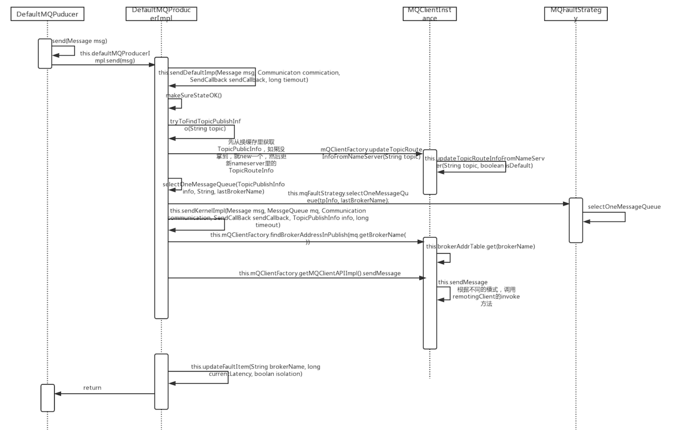

# rocketmq producer发送消息过程




## DefaultMQProducer

### 构造函数

DefaultMQProducer()、DefaultMQProducer(final String producerGroup)、DefaultMQProducer(RPCHook rpcHook) 这个几个构造函数都是调用下面的实现。
```
public DefaultMQProducer(final String producerGroup, RPCHook rpcHook) {
    this.producerGroup = producerGroup;
    defaultMQProducerImpl = new DefaultMQProducerImpl(this, rpcHook);
}
```

### 发送消息send方法

#### 同步发送

DefaultMQProducer中重载了多个同步消息发送的方法，所有的方法都是调用DefaultMQProducerImple的`sendDefaultImpl(Message msg, Communication commnuication, SendCallback sendCallback, long timeout)`

```
public SendResult send(
    Message msg) throws MQClientException, RemotingException, MQBrokerException, InterruptedException {
    return this.defaultMQProducerImpl.send(msg);
}
```

#### 异步发送
和同步发送一样，DefaultMQProducer中也重载了多种异步消息发送的方法，所有的方法都是调用DefaultMQProducerImpl的`send(Message msg, SendCallback sendCallback, long timeout)`, 但是该方法在rocketmq的下一个版本将会被废弃，其实该方法的核心实现也是调用本类的`sendDefaultImpl(Message msg, Communication commnuication, SendCallback sendCallback, long timeout)`。

```
public void send(Message msg,
    SendCallback sendCallback) throws MQClientException, RemotingException, InterruptedException {
    this.defaultMQProducerImpl.send(msg, sendCallback);
}
```

#### 单向发送

和上面有种形式一样，具体实现是调用DefaultMQProducerImple的`sendDefaultImpl(Message msg, Communication commnuication, SendCallback sendCallback, long timeout)`。

```
public void sendOneway(Message msg) throws MQClientException, RemotingException, InterruptedException {
    this.defaultMQProducerImpl.sendOneway(msg);
}
```

#### 三种方式的不同
同步发送方式：需要等待接受发送接口，返回一个 SendResult 对象。
异步发送方式：不需要等待返回结果，发送直接返回，但是需要实现一个 SendCallback 接口，在消息发送完成后调用。
单向发送方式：类似于UDP，该方法不会等待broker确认直接返回，它具有最大的吞吐量，但是有可能存在消息丢失。

#### defaultMQProducerImpl.send(Message msg, final CommunicationMode communicationMode, final SendCallback sendCallback, final long timeout) 具体实现

主要的几个方法调用：
- tryToFindTopicPublishInfo(String topicName) // 获取TopicPublishInfo
- selectOneMessageQueue(TopicPublishInfo topicPublishInfo, String lastBrokerName) // 选择要将消息发送到那个mq队列
- sendKernelImpl(Message msg, MessageQueue mq, CommunicationMode communicationMode, SendCallback sendCallback, TopicPublishInfo topicPublishInfo, long timeout) // 发送消息的核心实现
- updateFaultItem(String brokerName, long currentLatency, boolean isolation) // 更新broker可用信息

上面的所有方法都是在DefaultMQProducerImpl类中进行实现

```
 private SendResult sendDefaultImpl(
    Message msg,
    final CommunicationMode communicationMode,
    final SendCallback sendCallback,
    final long timeout
) throws MQClientException, RemotingException, MQBrokerException, InterruptedException {
    this.makeSureStateOK(); // 检查producer是否在运行状态
    Validators.checkMessage(msg, this.defaultMQProducer); // 检测要发送的消息合法性

    final long invokeID = random.nextLong();
    long beginTimestampFirst = System.currentTimeMillis();
    long beginTimestampPrev = beginTimestampFirst;
    long endTimestamp = beginTimestampFirst;
    TopicPublishInfo topicPublishInfo = this.tryToFindTopicPublishInfo(msg.getTopic()); // 获取topic路由信息
    if (topicPublishInfo != null && topicPublishInfo.ok()) {
        boolean callTimeout = false;
        MessageQueue mq = null;
        Exception exception = null;
        SendResult sendResult = null;
        int timesTotal = communicationMode == CommunicationMode.SYNC ? 1 + this.defaultMQProducer.getRetryTimesWhenSendFailed() : 1; // 同步多次调用
        int times = 0;
        String[] brokersSent = new String[timesTotal]; // 记录每次发送的broker
        for (; times < timesTotal; times++) {
            String lastBrokerName = null == mq ? null : mq.getBrokerName();
            MessageQueue mqSelected = this.selectOneMessageQueue(topicPublishInfo, lastBrokerName); // 选取消息队列
            if (mqSelected != null) {
                mq = mqSelected;
                brokersSent[times] = mq.getBrokerName();
                try {
                    beginTimestampPrev = System.currentTimeMillis();
                    long costTime = beginTimestampPrev - beginTimestampFirst;
                    if (timeout < costTime) {
                        callTimeout = true;
                        break;
                    }

                    sendResult = this.sendKernelImpl(msg, mq, communicationMode, sendCallback, topicPublishInfo, timeout - costTime); // 调用发送消息的核心实现方法
                    endTimestamp = System.currentTimeMillis();
                    // 更新延迟容错信息
                    this.updateFaultItem(mq.getBrokerName(), endTimestamp - beginTimestampPrev, false);
                    switch (communicationMode) {
                        case ASYNC:
                            return null;
                        case ONEWAY:
                            return null;
                        case SYNC:
                            // 如果是同步方式发送，并且发送失败，会进入多次重试
                            if (sendResult.getSendStatus() != SendStatus.SEND_OK) {
                                if (this.defaultMQProducer.isRetryAnotherBrokerWhenNotStoreOK()) {
                                    continue;
                                }
                            }

                            return sendResult;
                        default:
                            break;
                    }
                } catch (RemotingException e) {
                    endTimestamp = System.currentTimeMillis();
                    this.updateFaultItem(mq.getBrokerName(), endTimestamp - beginTimestampPrev, true);
                    log.warn(String.format("sendKernelImpl exception, resend at once, InvokeID: %s, RT: %sms, Broker: %s", invokeID, endTimestamp - beginTimestampPrev, mq), e);
                    log.warn(msg.toString());
                    exception = e;
                    continue;
                } catch (MQClientException e) {
                    endTimestamp = System.currentTimeMillis();
                    this.updateFaultItem(mq.getBrokerName(), endTimestamp - beginTimestampPrev, true);
                    log.warn(String.format("sendKernelImpl exception, resend at once, InvokeID: %s, RT: %sms, Broker: %s", invokeID, endTimestamp - beginTimestampPrev, mq), e);
                    log.warn(msg.toString());
                    exception = e;
                    continue;
                } catch (MQBrokerException e) {
                    endTimestamp = System.currentTimeMillis();
                    this.updateFaultItem(mq.getBrokerName(), endTimestamp - beginTimestampPrev, true);
                    log.warn(String.format("sendKernelImpl exception, resend at once, InvokeID: %s, RT: %sms, Broker: %s", invokeID, endTimestamp - beginTimestampPrev, mq), e);
                    log.warn(msg.toString());
                    exception = e;
                    switch (e.getResponseCode()) {
                        case ResponseCode.TOPIC_NOT_EXIST:
                        case ResponseCode.SERVICE_NOT_AVAILABLE:
                        case ResponseCode.SYSTEM_ERROR:
                        case ResponseCode.NO_PERMISSION:
                        case ResponseCode.NO_BUYER_ID:
                        case ResponseCode.NOT_IN_CURRENT_UNIT:
                            continue;
                        default:
                            if (sendResult != null) {
                                return sendResult;
                            }

                            throw e;
                    }
                } catch (InterruptedException e) {
                    endTimestamp = System.currentTimeMillis();
                    this.updateFaultItem(mq.getBrokerName(), endTimestamp - beginTimestampPrev, false);
                    log.warn(String.format("sendKernelImpl exception, throw exception, InvokeID: %s, RT: %sms, Broker: %s", invokeID, endTimestamp - beginTimestampPrev, mq), e);
                    log.warn(msg.toString());

                    log.warn("sendKernelImpl exception", e);
                    log.warn(msg.toString());
                    throw e;
                }
            } else {
                break;
            }
        }

        if (sendResult != null) {
            return sendResult;
        }

        String info = String.format("Send [%d] times, still failed, cost [%d]ms, Topic: %s, BrokersSent: %s",
            times,
            System.currentTimeMillis() - beginTimestampFirst,
            msg.getTopic(),
            Arrays.toString(brokersSent));

        info += FAQUrl.suggestTodo(FAQUrl.SEND_MSG_FAILED);

        MQClientException mqClientException = new MQClientException(info, exception);
        if (callTimeout) {
            throw new RemotingTooMuchRequestException("sendDefaultImpl call timeout");
        }

        if (exception instanceof MQBrokerException) {
            mqClientException.setResponseCode(((MQBrokerException) exception).getResponseCode());
        } else if (exception instanceof RemotingConnectException) {
            mqClientException.setResponseCode(ClientErrorCode.CONNECT_BROKER_EXCEPTION);
        } else if (exception instanceof RemotingTimeoutException) {
            mqClientException.setResponseCode(ClientErrorCode.ACCESS_BROKER_TIMEOUT);
        } else if (exception instanceof MQClientException) {
            mqClientException.setResponseCode(ClientErrorCode.BROKER_NOT_EXIST_EXCEPTION);
        }

        throw mqClientException;
    }

    List<String> nsList = this.getmQClientFactory().getMQClientAPIImpl().getNameServerAddressList();
    if (null == nsList || nsList.isEmpty()) {
        throw new MQClientException(
            "No name server address, please set it." + FAQUrl.suggestTodo(FAQUrl.NAME_SERVER_ADDR_NOT_EXIST_URL), null).setResponseCode(ClientErrorCode.NO_NAME_SERVER_EXCEPTION);
    }

    throw new MQClientException("No route info of this topic, " + msg.getTopic() + FAQUrl.suggestTodo(FAQUrl.NO_TOPIC_ROUTE_INFO),
        null).setResponseCode(ClientErrorCode.NOT_FOUND_TOPIC_EXCEPTION);
}
```

#### tryToFindTopicPublishInfo（String topicName）方法实现

首先，从缓存里取topicPublishInfo，如果从缓存里取得为null或者topicPushlishInfo的messageQueueList为空，则new一个，并扔进缓存，然后更新NameServer里的topic路由信息。更新topic路由信息的实现MQClientInstance类中，它代表一个mq客户端实例。

```
// 获取TopicPublishInfo
private TopicPublishInfo tryToFindTopicPublishInfo(final String topic) {
    TopicPublishInfo topicPublishInfo = this.topicPublishInfoTable.get(topic);
    // topicPublicInfo.ok() 就是判断TopicPublishInfo实例中的MessageQueue列表size是否 > 0
    if (null == topicPublishInfo || !topicPublishInfo.ok()) {
        this.topicPublishInfoTable.putIfAbsent(topic, new TopicPublishInfo());
        this.mQClientFactory.updateTopicRouteInfoFromNameServer(topic);
        topicPublishInfo = this.topicPublishInfoTable.get(topic);
    }

    if (topicPublishInfo.isHaveTopicRouterInfo() || topicPublishInfo.ok()) {
        return topicPublishInfo;
    } else {
        this.mQClientFactory.updateTopicRouteInfoFromNameServer(topic, true, this.defaultMQProducer);
        topicPublishInfo = this.topicPublishInfoTable.get(topic);
        return topicPublishInfo;
    }
}
// 更新topic路由信息
public boolean updateTopicRouteInfoFromNameServer(final String topic, boolean isDefault, DefaultMQProducer defaultMQProducer) {
    try {
        if (this.lockNamesrv.tryLock(LOCK_TIMEOUT_MILLIS, TimeUnit.MILLISECONDS)) {
            try {
                TopicRouteData topicRouteData;
                if (isDefault && defaultMQProducer != null) { // 更新mq默认topic路由信息
                    topicRouteData = this.mQClientAPIImpl.getDefaultTopicRouteInfoFromNameServer(defaultMQProducer.getCreateTopicKey(),
                        1000 * 3);
                    if (topicRouteData != null) {
                        for (QueueData data : topicRouteData.getQueueDatas()) {
                            int queueNums = Math.min(defaultMQProducer.getDefaultTopicQueueNums(), data.getReadQueueNums());
                            data.setReadQueueNums(queueNums);
                            data.setWriteQueueNums(queueNums);
                        }
                    }
                } else {
                    topicRouteData = this.mQClientAPIImpl.getTopicRouteInfoFromNameServer(topic, 1000 * 3);
                }
                if (topicRouteData != null) {
                    TopicRouteData old = this.topicRouteTable.get(topic);
                    boolean changed = topicRouteDataIsChange(old, topicRouteData);
                    if (!changed) {
                        changed = this.isNeedUpdateTopicRouteInfo(topic);
                    } else {
                        log.info("the topic[{}] route info changed, old[{}] ,new[{}]", topic, old, topicRouteData);
                    }

                    if (changed) {
                        TopicRouteData cloneTopicRouteData = topicRouteData.cloneTopicRouteData();

                        for (BrokerData bd : topicRouteData.getBrokerDatas()) {
                            this.brokerAddrTable.put(bd.getBrokerName(), bd.getBrokerAddrs());
                        }

                        // Update Pub info
                        {
                            TopicPublishInfo publishInfo = topicRouteData2TopicPublishInfo(topic, topicRouteData);
                            publishInfo.setHaveTopicRouterInfo(true);
                            Iterator<Entry<String, MQProducerInner>> it = this.producerTable.entrySet().iterator();
                            while (it.hasNext()) {
                                Entry<String, MQProducerInner> entry = it.next();
                                MQProducerInner impl = entry.getValue();
                                if (impl != null) {
                                    impl.updateTopicPublishInfo(topic, publishInfo);
                                }
                            }
                        }

                        // Update sub info
                        {
                            Set<MessageQueue> subscribeInfo = topicRouteData2TopicSubscribeInfo(topic, topicRouteData);
                            Iterator<Entry<String, MQConsumerInner>> it = this.consumerTable.entrySet().iterator();
                            while (it.hasNext()) {
                                Entry<String, MQConsumerInner> entry = it.next();
                                MQConsumerInner impl = entry.getValue();
                                if (impl != null) {
                                    impl.updateTopicSubscribeInfo(topic, subscribeInfo);
                                }
                            }
                        }
                        log.info("topicRouteTable.put. Topic = {}, TopicRouteData[{}]", topic, cloneTopicRouteData);
                        this.topicRouteTable.put(topic, cloneTopicRouteData);
                        return true;
                    }
                } else {
                    log.warn("updateTopicRouteInfoFromNameServer, getTopicRouteInfoFromNameServer return null, Topic: {}", topic);
                }
            } catch (Exception e) {
                if (!topic.startsWith(MixAll.RETRY_GROUP_TOPIC_PREFIX) && !topic.equals(MixAll.AUTO_CREATE_TOPIC_KEY_TOPIC)) {
                    log.warn("updateTopicRouteInfoFromNameServer Exception", e);
                }
            } finally {
                this.lockNamesrv.unlock();
            }
        } else {
            log.warn("updateTopicRouteInfoFromNameServer tryLock timeout {}ms", LOCK_TIMEOUT_MILLIS);
        }
    } catch (InterruptedException e) {
        log.warn("updateTopicRouteInfoFromNameServer Exception", e);
    }

    return false;
}
```

#### selectOneMessageQueue(TopicPublishInfo topicPublishInfo, String lastBrokerName) 实现
DefaultMQProducerImpl类的该方法，具体实现调用了MQFaultStrategy的`selectOneMessageQueue(TopicPublishInfo topicPublishInfo, String lastBrokerName)`。具体从topicPublishInfo信息里取出一个mq。

TopicPublishInfo 类结构

```
TopicPublicInfo
    - boolean orderTopic
    - boolean haveTopicRouterInfo
    - List<MessageQueue> messageQueueLis
    - ThreadLocalIndex sendWhichQueue
    - TopicRouteData topicRouteData
        MessageQueue
            - String topic
            - String brokerName
            - int queueId
        ThreadLocalIndex
            - ThreadLocal<Integer> threadLocalIndex
            - Random random
        TopicRouteData
            - String orderTopicConf
            - List<QueueData> queueDatas
            - List<BrokerData> brokerDatas
            - HashMap<String, List<String>> filterServerTable
                QueueData
                    - String brokerName;
                    - int readQueueNums;
                    - int writeQueueNums;
                    - int perm;
                    - int topicSynFlag
                BrokerData
                    -String cluster;
                    - String brokerName;
                    - HashMap<Long, String> brokerAddrs;
                    - Random random = new Random();
```

这里会涉及到两个selectOneMessageQueue方法实现，具体实现在TopicPublishInfo类

- selectOneMessageQueue() //无参的实现
- selectOneMessageQueue(String lastBrokerName) // 接收brokerName的实现

```
public MessageQueue selectOneMessageQueue(final TopicPublishInfo tpInfo, final String lastBrokerName) {
    if (this.sendLatencyFaultEnable) { // 是否开启容错机制，默认关闭
        try {
            // 优先获取可用的队列
            int index = tpInfo.getSendWhichQueue().getAndIncrement();
            for (int i = 0; i < tpInfo.getMessageQueueList().size(); i++) {
                int pos = Math.abs(index++) % tpInfo.getMessageQueueList().size();
                if (pos < 0)
                    pos = 0;
                MessageQueue mq = tpInfo.getMessageQueueList().get(pos);
                if (latencyFaultTolerance.isAvailable(mq.getBrokerName())) {
                    if (null == lastBrokerName || mq.getBrokerName().equals(lastBrokerName))
                        return mq;
                }
            }
            // 其次从broker中获取一个队列，不考虑可用性
            final String notBestBroker = latencyFaultTolerance.pickOneAtLeast();
            int writeQueueNums = tpInfo.getQueueIdByBroker(notBestBroker);
            if (writeQueueNums > 0) {
                final MessageQueue mq = tpInfo.selectOneMessageQueue();
                if (notBestBroker != null) {
                    mq.setBrokerName(notBestBroker);
                    mq.setQueueId(tpInfo.getSendWhichQueue().getAndIncrement() % writeQueueNums);
                }
                return mq;
            } else {
                latencyFaultTolerance.remove(notBestBroker);
            }
        } catch (Exception e) {
            log.error("Error occurred when selecting message queue", e);
        }

        return tpInfo.selectOneMessageQueue();
    }

    return tpInfo.selectOneMessageQueue(lastBrokerName);
}

// TopicPublishInfo 无参的 selectOneMessageQueue
public MessageQueue selectOneMessageQueue() {
    int index = this.sendWhichQueue.getAndIncrement();
    int pos = Math.abs(index) % this.messageQueueList.size();
    if (pos < 0)
        pos = 0;
    return this.messageQueueList.get(pos);
}

// TopicPublishInfo 接收brokerName的 selectOneMessageQueue
public MessageQueue selectOneMessageQueue(final String lastBrokerName) {
    if (lastBrokerName == null) {
        return selectOneMessageQueue();
    } else {
        int index = this.sendWhichQueue.getAndIncrement();
        for (int i = 0; i < this.messageQueueList.size(); i++) {
            int pos = Math.abs(index++) % this.messageQueueList.size();
            if (pos < 0)
                pos = 0;
            MessageQueue mq = this.messageQueueList.get(pos);
            if (!mq.getBrokerName().equals(lastBrokerName)) {
                return mq;
            }
        }
        return selectOneMessageQueue();
    }
}
```

## sendKernelImpl(Message msg, MessageQueue mq, CommunicationMode communicationMode, SendCallback sendCallback, TopicPublishInfo topicPublishInfo, long timeout) 实现

```
private SendResult sendKernelImpl(final Message msg,
                                  final MessageQueue mq,
                                  final CommunicationMode communicationMode,
                                  final SendCallback sendCallback,
                                  final TopicPublishInfo topicPublishInfo,
                                  final long timeout) throws MQClientException, RemotingException, MQBrokerException, InterruptedException {
    long beginStartTime = System.currentTimeMillis();
    String brokerAddr = this.mQClientFactory.findBrokerAddressInPublish(mq.getBrokerName());
    if (null == brokerAddr) {
        tryToFindTopicPublishInfo(mq.getTopic());
        brokerAddr = this.mQClientFactory.findBrokerAddressInPublish(mq.getBrokerName());
    }

    SendMessageContext context = null;
    if (brokerAddr != null) {
        brokerAddr = MixAll.brokerVIPChannel(this.defaultMQProducer.isSendMessageWithVIPChannel(), brokerAddr);

        byte[] prevBody = msg.getBody();
        try {
            //for MessageBatch,ID has been set in the generating process
            if (!(msg instanceof MessageBatch)) {
                MessageClientIDSetter.setUniqID(msg);
            }

            int sysFlag = 0;
            boolean msgBodyCompressed = false;
            if (this.tryToCompressMessage(msg)) {
                sysFlag |= MessageSysFlag.COMPRESSED_FLAG;
                msgBodyCompressed = true;
            }

            final String tranMsg = msg.getProperty(MessageConst.PROPERTY_TRANSACTION_PREPARED);
            if (tranMsg != null && Boolean.parseBoolean(tranMsg)) {
                sysFlag |= MessageSysFlag.TRANSACTION_PREPARED_TYPE;
            }

            if (hasCheckForbiddenHook()) {
                CheckForbiddenContext checkForbiddenContext = new CheckForbiddenContext();
                checkForbiddenContext.setNameSrvAddr(this.defaultMQProducer.getNamesrvAddr());
                checkForbiddenContext.setGroup(this.defaultMQProducer.getProducerGroup());
                checkForbiddenContext.setCommunicationMode(communicationMode);
                checkForbiddenContext.setBrokerAddr(brokerAddr);
                checkForbiddenContext.setMessage(msg);
                checkForbiddenContext.setMq(mq);
                checkForbiddenContext.setUnitMode(this.isUnitMode());
                this.executeCheckForbiddenHook(checkForbiddenContext);
            }

            if (this.hasSendMessageHook()) {
                context = new SendMessageContext();
                context.setProducer(this);
                context.setProducerGroup(this.defaultMQProducer.getProducerGroup());
                context.setCommunicationMode(communicationMode);
                context.setBornHost(this.defaultMQProducer.getClientIP());
                context.setBrokerAddr(brokerAddr);
                context.setMessage(msg);
                context.setMq(mq);
                String isTrans = msg.getProperty(MessageConst.PROPERTY_TRANSACTION_PREPARED);
                if (isTrans != null && isTrans.equals("true")) {
                    context.setMsgType(MessageType.Trans_Msg_Half);
                }

                if (msg.getProperty("__STARTDELIVERTIME") != null || msg.getProperty(MessageConst.PROPERTY_DELAY_TIME_LEVEL) != null) {
                    context.setMsgType(MessageType.Delay_Msg);
                }
                this.executeSendMessageHookBefore(context);
            }

            SendMessageRequestHeader requestHeader = new SendMessageRequestHeader();
            requestHeader.setProducerGroup(this.defaultMQProducer.getProducerGroup());
            requestHeader.setTopic(msg.getTopic());
            requestHeader.setDefaultTopic(this.defaultMQProducer.getCreateTopicKey());
            requestHeader.setDefaultTopicQueueNums(this.defaultMQProducer.getDefaultTopicQueueNums());
            requestHeader.setQueueId(mq.getQueueId());
            requestHeader.setSysFlag(sysFlag);
            requestHeader.setBornTimestamp(System.currentTimeMillis());
            requestHeader.setFlag(msg.getFlag());
            requestHeader.setProperties(MessageDecoder.messageProperties2String(msg.getProperties()));
            requestHeader.setReconsumeTimes(0);
            requestHeader.setUnitMode(this.isUnitMode());
            requestHeader.setBatch(msg instanceof MessageBatch);
            if (requestHeader.getTopic().startsWith(MixAll.RETRY_GROUP_TOPIC_PREFIX)) {
                String reconsumeTimes = MessageAccessor.getReconsumeTime(msg);
                if (reconsumeTimes != null) {
                    requestHeader.setReconsumeTimes(Integer.valueOf(reconsumeTimes));
                    MessageAccessor.clearProperty(msg, MessageConst.PROPERTY_RECONSUME_TIME);
                }

                String maxReconsumeTimes = MessageAccessor.getMaxReconsumeTimes(msg);
                if (maxReconsumeTimes != null) {
                    requestHeader.setMaxReconsumeTimes(Integer.valueOf(maxReconsumeTimes));
                    MessageAccessor.clearProperty(msg, MessageConst.PROPERTY_MAX_RECONSUME_TIMES);
                }
            }

            SendResult sendResult = null;
            switch (communicationMode) {
                case ASYNC:
                    Message tmpMessage = msg;
                    if (msgBodyCompressed) {
                        //If msg body was compressed, msgbody should be reset using prevBody.
                        //Clone new message using commpressed message body and recover origin massage.
                        //Fix bug:https://github.com/apache/rocketmq-externals/issues/66
                        tmpMessage = MessageAccessor.cloneMessage(msg);
                        msg.setBody(prevBody);
                    }
                    long costTimeAsync = System.currentTimeMillis() - beginStartTime;
                    if (timeout < costTimeAsync) {
                        throw new RemotingTooMuchRequestException("sendKernelImpl call timeout");
                    }
                    sendResult = this.mQClientFactory.getMQClientAPIImpl().sendMessage(
                        brokerAddr,
                        mq.getBrokerName(),
                        tmpMessage,
                        requestHeader,
                        timeout - costTimeAsync,
                        communicationMode,
                        sendCallback,
                        topicPublishInfo,
                        this.mQClientFactory,
                        this.defaultMQProducer.getRetryTimesWhenSendAsyncFailed(),
                        context,
                        this);
                    break;
                case ONEWAY:
                case SYNC:
                    long costTimeSync = System.currentTimeMillis() - beginStartTime;
                    if (timeout < costTimeSync) {
                        throw new RemotingTooMuchRequestException("sendKernelImpl call timeout");
                    }
                    sendResult = this.mQClientFactory.getMQClientAPIImpl().sendMessage(
                        brokerAddr,
                        mq.getBrokerName(),
                        msg,
                        requestHeader,
                        timeout - costTimeSync,
                        communicationMode,
                        context,
                        this);
                    break;
                default:
                    assert false;
                    break;
            }

            if (this.hasSendMessageHook()) {
                context.setSendResult(sendResult);
                this.executeSendMessageHookAfter(context);
            }

            return sendResult;
        } catch (RemotingException e) {
            if (this.hasSendMessageHook()) {
                context.setException(e);
                this.executeSendMessageHookAfter(context);
            }
            throw e;
        } catch (MQBrokerException e) {
            if (this.hasSendMessageHook()) {
                context.setException(e);
                this.executeSendMessageHookAfter(context);
            }
            throw e;
        } catch (InterruptedException e) {
            if (this.hasSendMessageHook()) {
                context.setException(e);
                this.executeSendMessageHookAfter(context);
            }
            throw e;
        } finally {
            msg.setBody(prevBody);
        }
    }

    throw new MQClientException("The broker[" + mq.getBrokerName() + "] not exist", null);
}

```

1. 根据brokerName获取broker地址, 默认获取master // 消息的发送不可能往salve上发

```
public String findBrokerAddressInPublish(final String brokerName) {
    HashMap<Long/* brokerId */, String/* address */> map = this.brokerAddrTable.get(brokerName);
    if (map != null && !map.isEmpty()) {
        return map.get(MixAll.MASTER_ID);
    }

    return null;
}
```

2. 如果开启了vipChannel, 更新brokerAddr

```
brokerAddr = MixAll.brokerVIPChannel(this.defaultMQProducer.isSendMessageWithVIPChannel(), brokerAddr);
```

3. 消息压缩及事务消息判断

```
boolean msgBodyCompressed = false;
if (this.tryToCompressMessage(msg)) {
    sysFlag |= MessageSysFlag.COMPRESSED_FLAG;
    msgBodyCompressed = true;
}

final String tranMsg = msg.getProperty(MessageConst.PROPERTY_TRANSACTION_PREPARED);
if (tranMsg != null && Boolean.parseBoolean(tranMsg)) {
    sysFlag |= MessageSysFlag.TRANSACTION_PREPARED_TYPE;
}
```

4. 执行两个钩子（CheckForbiddenHook、SendMessageHook）
5. 构造发送消息请求头SendMessageRequestHeader对象
6. 根据不同的消息发送模式，调用MQ客户端实例(MQClientStance)的消息发送方法

```
sendMessage(String addr, String brokerName, Message msg, SendMessageRequestHeader requestHeader, long timeoutMillis, CommunicationMode communicationMode, SendCallback sendCallback, TopicPublishInfo topicPublishInfo, MQClientInstance instance, int retryTimesWhenSendFailed, SendMessageContext context, DefaultMQProducerImpl producer)
```

#### MQClientStance的 `sendMessage(String addr, String brokerName, Message msg, SendMessageRequestHeader requestHeader, long timeoutMillis, CommunicationMode communicationMode, SendCallback sendCallback, TopicPublishInfo topicPublishInfo, MQClientInstance instance, int retryTimesWhenSendFailed, SendMessageContext context, DefaultMQProducerImpl producer)` 方法实现

```
public SendResult sendMessage(
    final String addr,
    final String brokerName,
    final Message msg,
    final SendMessageRequestHeader requestHeader,
    final long timeoutMillis,
    final CommunicationMode communicationMode,
    final SendCallback sendCallback,
    final TopicPublishInfo topicPublishInfo,
    final MQClientInstance instance,
    final int retryTimesWhenSendFailed,
    final SendMessageContext context,
    final DefaultMQProducerImpl producer
) throws RemotingException, MQBrokerException, InterruptedException {
    long beginStartTime = System.currentTimeMillis();
    RemotingCommand request = null;
    if (sendSmartMsg || msg instanceof MessageBatch) {
        SendMessageRequestHeaderV2 requestHeaderV2 = SendMessageRequestHeaderV2.createSendMessageRequestHeaderV2(requestHeader);
        request = RemotingCommand.createRequestCommand(msg instanceof MessageBatch ? RequestCode.SEND_BATCH_MESSAGE : RequestCode.SEND_MESSAGE_V2, requestHeaderV2);
    } else {
        request = RemotingCommand.createRequestCommand(RequestCode.SEND_MESSAGE, requestHeader);
    }

    request.setBody(msg.getBody());

    // 不同的发送模式，调用不同的实现，remotingClient
    switch (communicationMode) {
        case ONEWAY:
            this.remotingClient.invokeOneway(addr, request, timeoutMillis);
            return null;
        case ASYNC:
            final AtomicInteger times = new AtomicInteger();
            long costTimeAsync = System.currentTimeMillis() - beginStartTime;
            if (timeoutMillis < costTimeAsync) {
                throw new RemotingTooMuchRequestException("sendMessage call timeout");
            }
            this.sendMessageAsync(addr, brokerName, msg, timeoutMillis - costTimeAsync, request, sendCallback, topicPublishInfo, instance,
                retryTimesWhenSendFailed, times, context, producer);
            return null;
        case SYNC:
            long costTimeSync = System.currentTimeMillis() - beginStartTime;
            if (timeoutMillis < costTimeSync) {
                throw new RemotingTooMuchRequestException("sendMessage call timeout");
            }
            return this.sendMessageSync(addr, brokerName, msg, timeoutMillis - costTimeSync, request);
        default:
            assert false;
            break;
    }

    return null;
}
```


#### updateFaultItem(String brokerName, long currentLatency, boolean isolation)

更新延迟容错信息。当 Producer 发送消息时间过长，则逻辑认为N秒内不可用。按照latencyMax，notAvailableDuration的配置，对应如下

```
private long[] latencyMax = {50L, 100L, 550L, 1000L, 2000L, 3000L, 15000L};
private long[] notAvailableDuration = {0L, 0L, 30000L, 60000L, 120000L, 180000L, 600000L};
```

| producer发送消息消费时长 | Broker不可用时长 |
| --- | --- |
| >= 15000 ms | 600 * 1000 ms |
| >= 3000 ms | 180 * 1000 ms |
| >= 2000 ms | 120 * 1000 ms |
| >= 1000 ms | 60 * 1000 ms |
| >= 550 ms | 30 * 1000 ms |
| >= 100 ms | 0 ms |
| >= 50 ms | 0 ms |

```
public void updateFaultItem(final String brokerName, final long currentLatency, boolean isolation) {
    if (this.sendLatencyFaultEnable) {
        long duration = computeNotAvailableDuration(isolation ? 30000 : currentLatency);
        this.latencyFaultTolerance.updateFaultItem(brokerName, currentLatency, duration);
    }
}
// 根据配置，计算broker不可用时间
private long computeNotAvailableDuration(final long currentLatency) {
    for (int i = latencyMax.length - 1; i >= 0; i--) {
        if (currentLatency >= latencyMax[i])
            return this.notAvailableDuration[i];
    }

    return 0;
}
// 进行更新
public void updateFaultItem(final String name, final long currentLatency, final long notAvailableDuration) {
    FaultItem old = this.faultItemTable.get(name);
    if (null == old) {
        final FaultItem faultItem = new FaultItem(name);
        faultItem.setCurrentLatency(currentLatency);
        faultItem.setStartTimestamp(System.currentTimeMillis() + notAvailableDuration);

        old = this.faultItemTable.putIfAbsent(name, faultItem);
        if (old != null) {
            old.setCurrentLatency(currentLatency);
            old.setStartTimestamp(System.currentTimeMillis() + notAvailableDuration);
        }
    } else {
        old.setCurrentLatency(currentLatency);
        old.setStartTimestamp(System.currentTimeMillis() + notAvailableDuration);
    }
}
```


