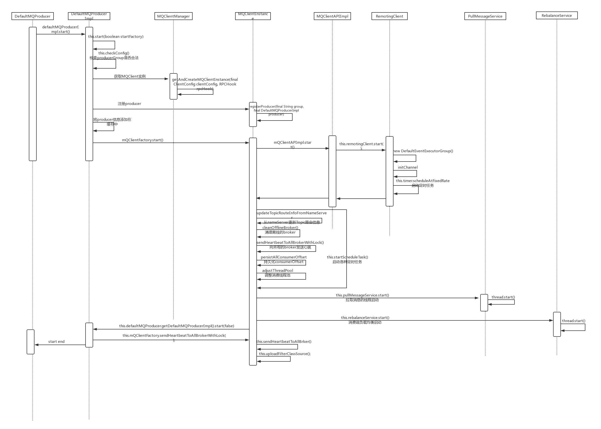

# rocketmq producer启动过程



## producer.start()

DefaultMQProducer 的 start 方式直接调用 DefaultMQProducerImpl 的 start 方法
```
public void start() throws MQClientException {
    this.defaultMQProducerImpl.start();
}
```

## defaultMQProducerImpl.start()

调用自己的内部方法 start(final boolean startFactory);

```
public void start(final boolean startFactory) throws MQClientException {
    switch (this.serviceState) {
        case CREATE_JUST:  // 初始化DefaultMQProducerImpl 是 this.serviceState 的值就是 CREATE_JUST
            this.serviceState = ServiceState.START_FAILED;

            this.checkConfig(); // 检测 producerGroup

            if (!this.defaultMQProducer.getProducerGroup().equals(MixAll.CLIENT_INNER_PRODUCER_GROUP)) {
                this.defaultMQProducer.changeInstanceNameToPID(); // 修改实例名
            }

            this.mQClientFactory = MQClientManager.getInstance().getAndCreateMQClientInstance(this.defaultMQProducer, rpcHook); // 创建MQClientInstance，见MQClientManager.getInstance().getAndCreateMQClientInstance(final ClientConfig clientConfig, RPCHook rpcHook)

            boolean registerOK = mQClientFactory.registerProducer(this.defaultMQProducer.getProducerGroup(), this); // 注册producer，将当前producer放进MQClientInstance的map中
            if (!registerOK) {
                this.serviceState = ServiceState.CREATE_JUST;
                throw new MQClientException("The producer group[" + this.defaultMQProducer.getProducerGroup()
                    + "] has been created before, specify another name please." + FAQUrl.suggestTodo(FAQUrl.GROUP_NAME_DUPLICATE_URL),
                    null);
            }

            this.topicPublishInfoTable.put(this.defaultMQProducer.getCreateTopicKey(), new TopicPublishInfo()); // 将topic信息放入缓存

            if (startFactory) {
                mQClientFactory.start(); // 见 MQClientFactory.start()
            }

            log.info("the producer [{}] start OK. sendMessageWithVIPChannel={}", this.defaultMQProducer.getProducerGroup(),
                this.defaultMQProducer.isSendMessageWithVIPChannel());
            this.serviceState = ServiceState.RUNNING;
            break;
        case RUNNING:
        case START_FAILED:
        case SHUTDOWN_ALREADY:
            throw new MQClientException("The producer service state not OK, maybe started once, "
                + this.serviceState
                + FAQUrl.suggestTodo(FAQUrl.CLIENT_SERVICE_NOT_OK),
                null);
        default:
            break;
    }

    this.mQClientFactory.sendHeartbeatToAllBrokerWithLock(); // 向broker发送心跳
}
```

## MQClientManager.getInstance().getAndCreateMQClientInstance(final ClientConfig clientConfig, RPCHook rpcHook)

从 MQClientManager 中获取 MQClientInstance
```
public MQClientInstance getAndCreateMQClientInstance(final ClientConfig clientConfig, RPCHook rpcHook) {
    String clientId = clientConfig.buildMQClientId();
    MQClientInstance instance = this.factoryTable.get(clientId); // 先从缓存里拿
    if (null == instance) { // 第一次instance为null
        instance =
            new MQClientInstance(clientConfig.cloneClientConfig(),
                this.factoryIndexGenerator.getAndIncrement(), clientId, rpcHook);  // new 一个
        MQClientInstance prev = this.factoryTable.putIfAbsent(clientId, instance); // 扔进缓存
        if (prev != null) {
            instance = prev;
            log.warn("Returned Previous MQClientInstance for clientId:[{}]", clientId);
        } else {
            log.info("Created new MQClientInstance for clientId:[{}]", clientId);
        }
    }

    return instance;
}
```

## mQClientFactory.start()

MQClientInstance的start方法，内部启动一系列的任务
```
public void start() throws MQClientException {

    synchronized (this) {
        switch (this.serviceState) {
            case CREATE_JUST:
                this.serviceState = ServiceState.START_FAILED;
                // 如果没有指定，则从NameServer中获取（从服务启动参数 ‘rocketmq.namesrv.domain’）
                if (null == this.clientConfig.getNamesrvAddr()) {
                    this.mQClientAPIImpl.fetchNameServerAddr();
                }
                // 启动 request-response 通道，封装了netty通信
                this.mQClientAPIImpl.start();
                // 启动各种定时任务，见 this.startScheduleTask()
                this.startScheduledTask();
                // 启动拉取消息服务
                this.pullMessageService.start();
                // 启动负载均衡服务
                this.rebalanceService.start();
                // 启动消息推送服务，回调 getDefaultMQProducerImpl.start 方法，但是startFactory参数为false，不会再次调用 mQClientInstance的start方法，进行了一个发送心跳到broker的操作
                this.defaultMQProducer.getDefaultMQProducerImpl().start(false);
                log.info("the client factory [{}] start OK", this.clientId);
                this.serviceState = ServiceState.RUNNING;
                break;
            case RUNNING:
                break;
            case SHUTDOWN_ALREADY:
                break;
            case START_FAILED:
                throw new MQClientException("The Factory object[" + this.getClientId() + "] has been created before, and failed.", null);
            default:
                break;
        }
    }
}
```

## this.startScheduleTask()

mQClientInstace 内部启动各种定时任务

```
private void startScheduledTask() {
    // 定时获取NameServer地址
    if (null == this.clientConfig.getNamesrvAddr()) {
        this.scheduledExecutorService.scheduleAtFixedRate(new Runnable() {

            @Override
            public void run() {
                try {
                    MQClientInstance.this.mQClientAPIImpl.fetchNameServerAddr();
                } catch (Exception e) {
                    log.error("ScheduledTask fetchNameServerAddr exception", e);
                }
            }
        }, 1000 * 10, 1000 * 60 * 2, TimeUnit.MILLISECONDS);
    }
    // 定时从NameServer更新Topic路由信息
    this.scheduledExecutorService.scheduleAtFixedRate(new Runnable() {

        @Override
        public void run() {
            try {
                MQClientInstance.this.updateTopicRouteInfoFromNameServer();
            } catch (Exception e) {
                log.error("ScheduledTask updateTopicRouteInfoFromNameServer exception", e);
            }
        }
    }, 10, this.clientConfig.getPollNameServerInterval(), TimeUnit.MILLISECONDS);
    // 定时清理下线的broker，然后发送心跳到broker
    this.scheduledExecutorService.scheduleAtFixedRate(new Runnable() {

        @Override
        public void run() {
            try {
                MQClientInstance.this.cleanOfflineBroker();
                MQClientInstance.this.sendHeartbeatToAllBrokerWithLock();
            } catch (Exception e) {
                log.error("ScheduledTask sendHeartbeatToAllBroker exception", e);
            }
        }
    }, 1000, this.clientConfig.getHeartbeatBrokerInterval(), TimeUnit.MILLISECONDS);
    // 定时存储consumerOffset
    this.scheduledExecutorService.scheduleAtFixedRate(new Runnable() {

        @Override
        public void run() {
            try {
                MQClientInstance.this.persistAllConsumerOffset();
            } catch (Exception e) {
                log.error("ScheduledTask persistAllConsumerOffset exception", e);
            }
        }
    }, 1000 * 10, this.clientConfig.getPersistConsumerOffsetInterval(), TimeUnit.MILLISECONDS);
    // 定时调整线程池
    this.scheduledExecutorService.scheduleAtFixedRate(new Runnable() {

        @Override
        public void run() {
            try {
                MQClientInstance.this.adjustThreadPool();
            } catch (Exception e) {
                log.error("ScheduledTask adjustThreadPool exception", e);
            }
        }
    }, 1, 1, TimeUnit.MINUTES);
}
```
