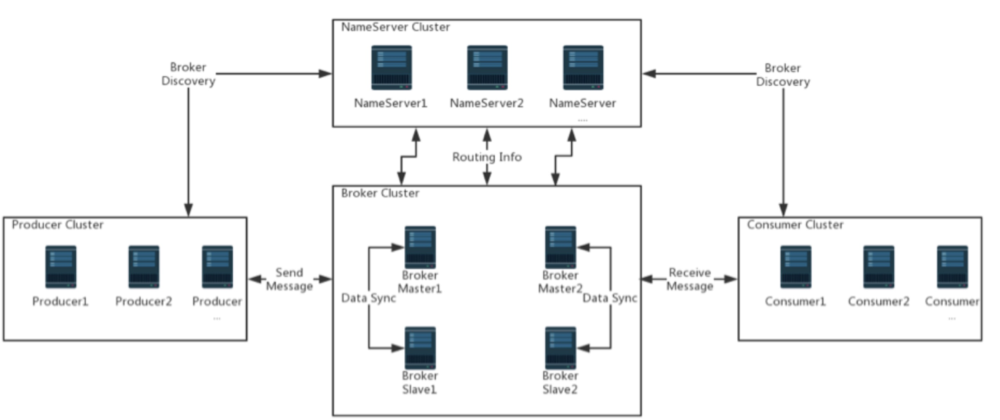
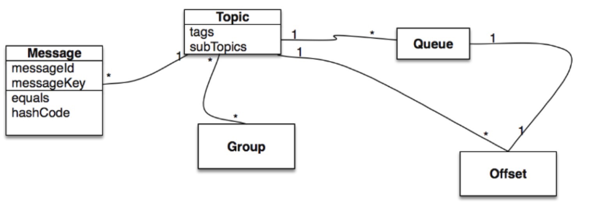

[Apache RocketMQ](http://rocketmq.apache.org/docs/quick-start/)

## simple example

RocketMQ 发送消息有三种模式：

- 同步（synchronous）
- 异步 （asynchronous）
- 单向传输（one-way transmission）

## FAQ

### 用法

- 一个新创建的consumer从哪里开始消费

    * 如果主题在三天内发送消息，则消费者开始使用服务器中保存的第一条消息中的消息。
    * 如果主题在三天前发送消息，则消费者开始使用服务器中最新消息的消息，换句话说，从消息队列的尾部开始。
    * 如果重新启动此类消费者，则它开始使用来自上一个消费位置的消息
    
 - 当消费失败，如何从新消费
 
    * 在集群消费模式下，consumer业务逻辑代码返回 `Action.ReconsumerLater`、`NULL`、或者抛出异常。如果一个消息被消费失败，会尝试16次，之后将被丢弃。
    * 广播消费模式下，广播消费仍确保消息至少消耗一次，但是没有提供重发选项。

- 如果消费失败，如果获取失败的消息

    * 使用topic按时间查询，可以在查询出一个时间段内的消息
    * 使用topic和 MessageId 精确获取消息
    * 使用topic和 message key 精确获取同一 message key的一类消息
    
- 消息是否只发送一次
    
    * RocketMQ确保所有消息至少传递一次。在大多数情况下，不会重复这些消息。
    
- 如何新增一个broker
    
    * 启动一个新的 broker，然后注册到同一样的 name server 中
    * 默认的，仅自动创建内部系统主题和消费者组，如果您希望在新节点上拥有业务主题和消费者组，可以从已有的broker复制， `admin tool`和 命令行可以实现
  
### 配置

> 下面的答案都是默认值，可以在配置中修改

- 消息在服务器中可以保存多久

> 3天，超过3天未被消费的消息将被删除

- 消息体的大小限制

> 通常 256kb

- 如果设置消费者线程数量

> 启动消费者时，可以设置 `ConsumeThreadNums` 属性，如：

```
consumer.setConsumerThreadMin(20);
consumer.setConsumerThreadMax(20);
```

### 错误

- 如果启动生产者或者消费者失败，失败消息提示生产者组或者消费者重复

原因: 

> 在同一个JVM，使用了相同的 producer/consumer 组启动多个 producer/consumer 实例，将会导致客户端启动失败

解决:

> 确保与一个 producer/consumer 组相对应的JVM仅与一个 producer/consumer 实例一起启动。

- 如果consumer 在广播模式下，加载json文件失败

原因: 

> Fastjson版本太低，不允许广播消费者加载本地 `offsets.json`, 导致consumer启动失败。损坏的fastjson文件也可能导致同样的问题。

解决:

> 升级 fastjosn 到和 rocketmq 客户端相同的版本，以确保可以加载本地 offsets.json

- 一台 broker 宕机会有什么影响

    * Master 宕机
    
    > 消息无法再发送到 broker, 但是如果有另一台broker可用，如果主题存在，仍然可以发送消息。消息仍然可以从 slave 服务器中消耗。
    
    * slave 宕机
    
    > 只要有另一个工作的 slave，就不会对发送消息产生影响，消息消费也没有影响，除非消费者组设置为优先使用当前损坏的 slave。消费者默认从master消费消息
    
    * 所有的 slave 宕机
    
    > 向master发送消息不会有任何影响，但是，master是 `SYNC_MASTER`，producer 将会得到一个 `SLAVE_NOT_AVAILABLE` 的值，表明消息不会发送到任何一台 slave。消息消费也不会受影响，除非消费者组设置了优先从 slave消费。消费者默认从master消费消息。
    
- producer 出现 'No Topic Route Info' ，如何诊断
    
> 当你尝试给一个 topic 发送消息，但是 topic 的路由的消息对于该producer是不可用的，这种情况就会出现。

    * 确保producer可以连接上name server，且能够从中获取路由元信息
    * 确保NameServer包含topic的路由元数据，可以使用管理工具或Web控制台通过topicRoute从NameServer查询路由元信息。
    * 确保broker将心跳发送到生产者所连接的NameServer。
    * 确保topic的级别是6（读写）或者至少2（写）
    
> 如果找不到此主题，请通过管理工具命令updateTopic或Web控制台在代理上创建它。

## Architecture



Apache RocketMQ是一种低延迟、高可用、兆级别能力、灵活可扩展性的分布式消息传递和流媒体平台。
它包含四个组件：name server，brokers，producers，consumers。它们中的每一个都可以水平扩展而没有单一的故障点。

### NameServer 集群

name server 提供轻量级的服务发现和路由功能。每个 name server 记录了所有的路由信息。
提供了响应的读写服务，支持快速存储扩展。

### broker 集群

broker 复制消息存储，通过轻量级的 TOPIC 和 QUEUE 机制。它支持 pull 和 push 模式，包含错误
容忍机制，并提供强大的峰值填充和按原始时间顺序累积数千亿条消息的能力。另外，broker提供灾难恢复，丰富的指标统计和警报机制，
这些功能是传统的消息系统不具备的。

### producer 集群

producer 支持分布式部署。分布式的producers通过多种负载均衡模式向 broker 集群发送消息。发送过程支持快速故障并具有低延迟。

### consumer 集群

consumer 支持分布式部署，支持 push 和 pull 两种模式。支持集群消费和广播消费。它提供实时的消息订阅机制，能满足大多数的消费需求。

### NameServer

NameServer是一个功能齐全的服务器，主要包含两个功能：
 
 - Broker 管理，NameServer接收broker集群的注册，并且提供了心跳机制检查broker是否存活。
 - 路由管理，每个 NameServer会持有整个关于broker集群和队列信息，以供客户端获取。
 - 我们都知道。RocketMQ的客户端（producer/consumer）会从 NameServer获取队列信息，但是客户端是如何查找 NameSever 的地址呢？
    
    这里提供了四种方法寻找 NameServer地址：
        
        - 编码方式，`producer.setNamesrvAddr("ip:port")`;
        - Java 可选参数，使用 `rocketmq.namesrv.addr`
        - 环境变量，使用 `NAMESRV_ADDR`
        - HTTP EndPoint
        
### broker server

broker server 负责消息存储和传输、消息获取、HA保证等等。

broker 有几个重要的模块：

- 路由模块，broker的实体，持有来自客户端的请求
- 客户端管理器，管理所有的客户端（producer/consumer），维护消费者的topic订阅
- 存储服务，提供简单的api从物理磁盘存储和获取消息
- HA 服务，提供 master broker 和 slave 之间数据同步功能
- 索引服务，根据指定的key构建消息索引，提供快速的消息查询。


## 部署

### Name Server

为了确保当一个实例宕机，集群仍可以工作，建议两个及以上的 NameServer 实例。只要有一个名称服务器实例处于活动状态，整个群集就会保持服务状态。

名称服务器遵循无共享设计范例，Broker 发送心跳数据到所有的 NameServer，当生产者/消费者发送消息时，可以从任一一台可用的NameServer获取元数据。

### broker 

根据角色可以将 broker 分为两类：master、slave。 master broker 提供RW（读写）权限，slave broker 只读。

为了部署没有单点故障的高可用集群，应该部署多个 broker 集合。一个 broker 集合包含一个 brokerId 为0的 master和若干个brokerId非0的slave。
在一个集合里的所有broker具有相同的brokerName。在严重的场景下，一个broker集合至少有两个broker，每个topic都存在于两个或更多broker里。

### 配置

> 当部署一个 rocketmq 集群，推荐的配置列表如下

#### broker 配置

属性名 | 默认值 | 描述
---|---|---
listenPort | 10911 | 客户端监听端口
nameserverAddr | null | NameServer 地址
brokerIP1 | 网络接口的InetAddress | 如果有多个地址，应配置
brokerName | null | broker 名称
brokerClusterName | DefaultCluster | broker 所属集群
brokerId | 0 | brokerId， 0 表示master，正整数表示slave
storePathCommitLog | $HOME/store/commitlog/ | commitlog 存储文件路径
storePathConsumerQueue | $HOME/store/consumequeue/ | 消费队列存储路径
mapedFileSizeCommitLog | 1024`*`1024`*`1024(1G) | commitlog 文件大小
deleteWhen | 04 | 何时删除超出保留时间的提交日志
fileReserverdTime | 72 | 在删除之前保留commitlog的小时数
brokerRole | ASYNC_MASTER | SYNC_MASTER/ASYNC_MASTER/SLVAE
flushDiskType | ASYNC_FLUSH | {SYNC_FLUSH/ASYNC_FLUSH}.在确认生产者之前，SYNC_FLUSH模式的broker将每个消息刷新到磁盘上。另一方面，ASYNC_FLUSH模式的broker利用了组提交，实现了更好的性能。


### CLI admin TooL

路径: ${PACKAGE}/bin

`mqadmin`

### 复制模式

要确保不会丢失成功发布的消息，RocketMQ提供了一种复制模式，通过这两种复制方式获得更强的持久性和更高的可用性：同步和异步。

#### 复制：sync / async broker

和大多数的复制系统一样，sync broker 等待直到确认之前将提交日志复制到 slave。async broker，相反的，在master上处理消息后立即返回。

#### 如何配置

在conf文件夹下有RocketMQ发行版附带的三个预构建配置供您参考：

```
2m-2s-sync
2m-2s-async
2m-noslave
```

所有的配置使用 `ASYNC_FLUSH`


## 最佳实践

### 核心概念



根据上面的模型，可以深入研究有关消息传递系统设计的一些主题：

* 并发消费者
* 热点问题消费者
* 负载均衡消费者
* 消息路由
* 多连接
* Canary 部署

#### producer

> producer 将业务应用程序系统生成的消息发送给 broker。RocketMQ提供多种发送范例：同步，异步和单向。

#### producer group 

> 相同角色的producer集合，如果原始生产者在事务之后崩溃，则broker可以联系同一生产者组的不同生产者实例以提交或回滚事务。

==考虑到所提供的producer在发送消息方面足够强大，每个生产者组只允许一个实例，以避免不必要的producer实例初始化==

#### consumer

> 消费者从broker获取消息并将其提供给应用程序。对于应用程序而言,提供了两种consumer:

##### pullConsumer

> pull consumer 从broker主动拉取消息，一旦拉去了批量的消息，应用程序发起消费程序。

##### pushConsumer

> push consumer，反过来讲，封装消息提取，消费进度并维护其它内部工作，给出一个 callback 接口，让用户实现，当消息到达时执行。

#### consumer group

> 与之前提到的生产者组类似，相同角色的消费者被组合在一起并命名为消费者组。

consumer group 是一个很好的概念，在消息消费方面非常容易实现负载平衡和容错。

==同一个group的consumer，必须订阅相同的topic==

#### topic

> 主题是生产者传递消息和消费者提取消息的类

topic 与生产者和消费者的关系非常松散。具体而言，topic可能有零个，一个或多个producer向其发送消息。相反，producer可以发送不同主题的消息。
从消费者的角度来看，topic 可以由零个，一个或多个consumer group 订阅。类似地，consumer group 可以订阅一个或多个topic，只要该组的实例保持其订阅一致即可。

#### message

> 消息是要传递的信息。

消息必须有一个主题，可以将其解释为要发送给的message地址，消息还可以具有可选tag和额外的k-v对。例如，您可以为消息设置 business key，并在broker 服务器上查找消息以诊断开发期间的问题。

#### message queue

> topic 被划分为一个或多个子主题 “消息队列”。

#### Tag

> 标记，换句话说，子主题，为用户提供了额外的灵活性。

对于标记，来自同一业务模块的具有不同目的的消息可以具有相同的topic和不同的tag。tag有助于保持代码的清晰和连贯，而tag也可以方便RocketMQ提供的查询系统。

#### broker

> broker 是RocketMQ系统的主要组成部分。

接收存储从producer发送过来的消息，并准备处理来自消费者的拉取请求。它还存储与消息相关的元数据，包括consumer group，消耗进度 offset 和 topic/queue 信息

#### Name Server

> name server 作为路由信息的提供者. producer/consumer 客户端查找topic以找到相应的broker列表

#### Message model

- 集群
- 广播

#### 消息顺序

> 如果使用了 DefaultMQPushConsumer, 需要决定消费消息时顺序的还是并发的。

- 顺序的

按顺序使用消息意味着消息的使用顺序与生产者为每个消息队列发送的顺序相同，如果正在处理必需是全局顺序的场景，确保您使用的主题只有一个消息队列。

==如果指定了顺序消费，消息消耗的最大并发量是消费者组订阅的消息队列的数量。==

- 并发的

当并发的消费消息，消息使用的最大并发量仅受为每个consumer客户端指定的线程池的限制

==不再保证消息的顺序==

### broker

#### 角色

`ASYNC_MASTER`，`SYNC_MASTER`，`SLAVE`。如果不能容忍消息的丢失，建议部署 `SYNC_MASTER` 加 `SLAVE`。如果对消息的丢失是可以容忍的，
但是你想broker总是可用的，你可以部署`ASYNC_MASTER` 加 `SLAVE`。

#### FlushDiskType

建议使用 `ASYNC_FLUSH`, `SYNC_FLUSH` 代价很大而且会导致性能的流失。如果想要可靠，建议使用 `SYNC_MASTER` 加 `SLAVE`。

### producer

#### sendStatus

当发送消息，将会得到 `SendResult` 包含 `SendStatus`。 首先，假设消息的 `isWaitStoreMsgOk=true`(默认true)。
首先，我们假设Message的isWaitStoreMsgOK = true（默认为true）。如果没有，如果没有抛出异常，我们将始终获得SEND_OK。
以下是有关每种状态的说明：

##### FLUSH_DISK_TIMEOUT

如果 broker 设置 `MessageStoreConfig` 的 `FlushDiskType=SYNC_FLUSH`（默认ASYNC_FLUSH）,并且broker没有
在 `MessageStoreConfig` 的 `syncFlushTimeout`（默认5s） 时间内完成 flushing disk，将会得到这个状态。

##### FLUSH_SLAVE_TIMEOUT

如果 broker的角色是 `SYNC_MASTER`(默认是ASYNC_MASTER)，slave broker没有完成在`MessageStoreConfig` 的 `syncFlushTimeout`（默认5s） 时间内完成
master的同步，将会得到这个状态。

##### SLAVE_NOT_AVAILABLE

如果broker的角色是 `SYNC_MASTER`（默认是 ASYNC_MASTER），但是没有配置 slave broker，将会得到这个状态。

##### SEND_OK

`SEND_OK` 不意味着是可用的。为了确保没有消息丢失，应该启用 `SYNC_MASTER` 或者 `SYNC_FLUSH`。

#### 重复或者丢失

如果得到 `FLUSH_DISK_TIMEOUT`，`FLUSH_SLAVE_TIMEOUT`的同时并且broker发生了shutdown，就可能发生了消息的丢失。
这时，有两个选择，一个是就这样继续运行，这样将导致这条消息丢失；另一种就是重发消息，这样可能导致消息重复。
通常建议重发，然后找到一种在消费的时候去掉重复消息的方式。除非你觉得某些消息丢失并不重要。但请记住，当您获得SLAVE_NOT_AVAILABLE时，重新发送是无用的。
如果发生这种情况，应该保留现场并提醒cluster manager。

#### timeout

客户端发送请求到 broker，等待响应，但是最大响应时间过期了且没有响应，客户端将会抛出 `RemoteTimeoutException`。默认等待3s。您还可以使用send（msg，timeout）而不是send（msg）传递超时参数。
请注意，我们不建议等待时间太小，因为Broker需要一些时间来刷新磁盘或与slave同步。如果该值超过`syncFlushTimeout`，则该值可能影响不大，
因为Broker可能会在超时之前返回`FLUSH_SLAVE_TIMEOUT`或`FLUSH_SLAVE_TIMEOUT`的响应。

#### message size

我们建议消息的大小不应超过512K

#### Async sending

默认发送（msg）将阻塞，直到返回响应。因此，如果在意性能，我们建议使用send（msg，回调），它将以异步方式运行。

#### producer group

通常，生产者组没有任何影响。但是如果参与transaction，应该注意它。默认情况下，只能在同一个JVM中创建一个具有相同生产者组的生产者，这通常就足够了。

#### 线程安全

生产者是线程安全的，您可以在业务解决方案中使用它

#### 性能

如果想在一个 jvm 上为大数据处理创建多个 producer。建议：

- 使用 async 发送消息，若干producer(3-5个足够)
- 为每个producer 设置实例名

### consumer

#### consumer group 和订阅

您应该注意的第一件事是不同的消费者组可以独立地使用相同的主题，他们每个人都有自己的消费offset。请确保同一组内的每个消费者订阅相同的topic。

#### MessageListener

##### orderly

消费者将锁住每个MessageQueue以确保它按顺序逐个使用。这将导致性能损耗，但是在比较注重消息顺序的场景下是很适用的。不建议抛出异常，可以返回
`ConsumerOrderlyStatus.SUSPEND_CURRENT_QUEUE_A_MOMENT`。

##### concurrently

顾名思义，这类consumer将会并发的消费消息，建议使用这种方式，因为性能好。不建议抛出异常，可以返回 `ConsumerOrderlyStatus.RECONSUMER_LATER`。

##### 消费状态

对于 `MessageListenerConcurrently` 而言，可以返回 `RECONSUMER_LATER` 来告诉consumer，不立刻去消费而是稍后再消费。然后可以继续消费其他的消息。
对于 `MessageListenerOrderly` 而言，因为你关心顺序，不能跳过消息，但是你可以返回 `SUSPEND_CURRENT_QUEUE_A_MOMENT` 来告诉consumer稍等片刻。

##### 阻塞

不建议阻塞监听器，因为会阻塞线程池，甚至会中断消费程序。

#### 线程数

consumer 使用`ThreadPoolExecutor`在内部处理消费，因此您可以通过设置`setConsumeThreadMin`或`setConsumeThreadMax`来更改它。

#### ConsumeFromWhere

建立新的consumer group 时，它需要决定是否需要消耗已经存在于Broker中的历史消息。`CONSUME_FROM_LAST_OFFSET` 忽略历史消息，并消耗之后生成的任何内容。
`CONSUME_FROM_FIRST_OFFSET`将消费Broker中存在的每条消息。

#### Duplication

很多场景下会导致重复。比如:

- producer 重发消息（在 FLUSH_SLAVE_TIMEOUT 的情况下）
- consumer shutdown, 有些 offset 没有及时更新到broker

所以需要做一些额外的工作，如果你的应用不能容忍重复，例如，检查db的主键。

### NameServer

在 RocketMQ中， Name server 旨在协调分布式系统的每个组件，协调主要通过管理topic路由信息来实现。

管理包含下面两个部分：

- broker 定时更新每个name server 的元数据。
- name server 为客户端提供服务，包括生产者，消费者和命令行客户端以及最新的路由信息

因此，在启动 broker 和客户端之前，我们需要告诉broker和客户端如何通过提供名称服务器地址列表来访问名称服务器。在Apache RocketMQ中，这可以通过四种方式完成。

#### 编码方式

对于broker而言，可以指定 `namesrvAddr=name-server-ip1:port;name-server-ip2:port`在broker的配置文件。

对于producer和consumer而言，可以想下面这样提供name server 地址列表：

```
DefaultMQProducer producer = new DefaultMQProducer("please_rename_unique_group_name");
producer.setNamesrvAddr("name-server1-ip:port;name-server2-ip:port");

DefaultMQPushConsumer consumer = new DefaultMQPushConsumer("please_rename_unique_group_name");
consumer.setNamesrvAddr("name-server1-ip:port;name-server2-ip:port");
```

如果使用 admin 命令行工具，可以这样指定：

```
sh mqadmin command-name -n name-server-ip1:port;name-server-ip2:port -X OTHER-OPTION

```

一个简单的例子: `sh mqadmin -n localhost:9876 clusterList` 获取 name server 节点的 cluster 信息。

如果集成了 admin 命令行到你的大盘，可以这样：

```
DefaultMQAdminExt defaultMQAdminExt = new DefaultMQAdminExt("please_rename_unique_group_name");
defaultMQAdminExt.setNamesrvAddr("name-server1-ip:port;name-server2-ip:port");
```

#### Java 可选参数

name server 地址列表也可以通过在启动之前指定java选项 `rocketmq.namesrv.addr` 来提供给应用程序。

#### 环境变量

可以导出 `NAMESRV_ADDR` 环境变量。如果设置了，broker和客户端将检查并使用其值。

#### HTTP EndPoint

如果未使用前面提到的方法指定名称服务器地址列表，Apache RocketMQ将访问以下HTTP端点，每两分钟获取和更新名称服务器地址列表，初始延迟为10秒.

默认情况下，终点是：

`http://jmenv.tbsite.net:8080/rocketmq/nsaddr`

您可以使用以下Java选项覆盖`jmenv.tbsite.net`：`rocketmq.namesrv.domain`，您还可以使用此Java选项覆盖`nsaddr`部件：`rocketmq.namesrv.domain.subgroup`

如果你在生产环境运行RocketMQ，这种方式是推荐的，因为它提供了最大的灵活性-您可以根据name server的系统负载动态添加或删除name server节点，而无需重新启动broker和客户端。

#### 优先级

首先介绍的方法优先于后者:

`Programmatic way > Java Options > Environment Variable > HTTP Endpoint`

## 博客地址

